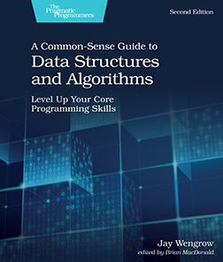

+++
outputs = ["Reveal"]
weight = 4
+++

@moh_noor94

{}

# How can You Prepare
## Right Now?

---

# انجح كهربا

---
# LinkedIn
---

# LinkedIn

{} **Title** {}
{} **Bio** {}
{} **Skills** {}
{} **Open to** {}
{} **Connections** {}
{} Experience {}
{} Projects {}
{} Activities {}
{} Recommendations {}

---

# LinkedIn

####  www.linkedin.com/in/mohnoor94/

---

# Build Your CV

---

# Build Your CV
{} **One** and only One **Page** {}
{} **No Pictures** {}
{} **No Personal Information** (Religion, Age, Relationship Status, Gender, etc.) {}

{} Keep it **Simple**, and use **Microsoft Word**! {}
{} Add **Links** to your **Projects** {}
{} Add **Links** to your **GitHub** and **LinkedIn** accounts {}

---

# Learn

---

# Learn
{} **Git & GitHub** {}
{} **X Programming Language** {}
{} **Problem Solving** {}

---

# Learn

### Cracking the Coding Interview

---
# Learn

### A Common-Sense Guide to Data Structures and Algorithms

---

# Focus on Your Projects
{} **Work in teams** {}
{} **Enjoy the process!** {}

{}
