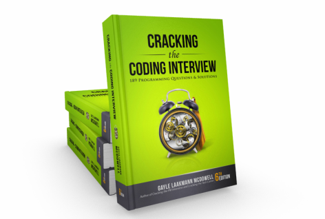

+++
outputs = ["Reveal"]
weight = 5
+++

@moh_noor94

{}

# How can You Prepare

## in the Last Few Months?

---

# Stick to a Plan!

---

# Read "Cracking the Coding Interview", AGAIN!

---

# Practice, Practice, & Practice!

{} [Technical Interview Preparation Kit](https://www.noor.guru/technical-interview-preparation-kit/) {}
{} [The HackerRank Interview Preparation Kit](https://www.hackerrank.com/interview/interview-preparation-kit) {}

---

# Schedule Multiple Interviews
And make this a habit!

---

# Fail Fast!

{}
